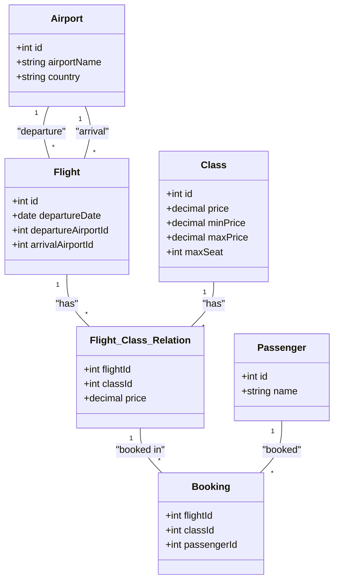

# Airport Ticket Booking System
A .NET console application for an airport ticket booking system. This application enable passengers to book flight tickets and allow a manager to manage the bookings.

## Data Storage
CSV files are used for the data storage layer.

## Passenger Features
1. **Book a Flight:**
    - Select a flight based on various search parameters.
    - Choose a class for the flight (Economy, Business, First Class). Prices should vary according to the class selected.
2. **Search for Available Flights:**
    - Parameters:
        - Price
        - Departure Country
        - Destination Country
        - Departure Date
        - Departure Airport
        - Arrival Airport
        - Class
3. **Manage Bookings:**
    - Cancel a booking
    - Modify a booking
    - View personal bookings

## Manager Features

1. **Filter Bookings:**
    - Parameters:
        - Flight
        - Price
        - Departure Country
        - Destination Country
        - Departure Date
        - Departure Airport
        - Arrival Airport
        - Passenger
        - Class
2. **Batch Flight Upload:**
    - Import a list of flights into the system using a CSV file.
3. **Validate Imported Flight Data:**
    - Apply model-level validations to the imported file data.
    - Return a detailed list of errors to help the manager identify and rectify issues in the imported file.
4. **Dynamic Model Validation Details:**
    - Provide dynamically generated details about the validation constraints for each field of the flight data model.
    - Example Result:
        - *Departure Country:*
            - Type: Free Text
            - Constraint: Required
        - *Departure Date:*
            - Type: Date Time
            - Constraint: Required, Allowed Range (today → future)

# DataBase Tables Structure

